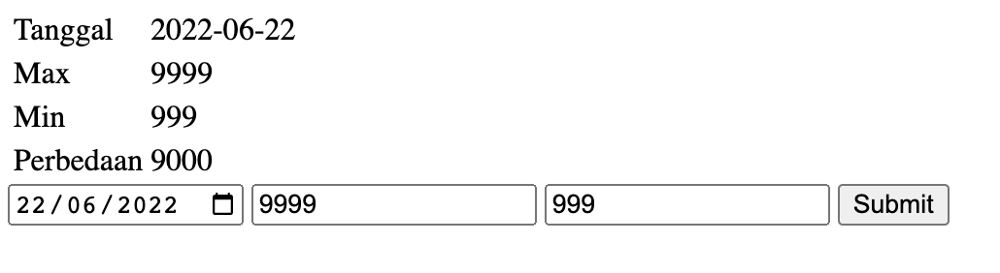

# Sirclo Technical interview

Note - Please run the Makefile to run the program

`make run` 

I'm using 3 Programming Languages to do this test
- C++ (Because It's more convinient to do OOP stuff with C++, and Golang doesn't support OOP)
- JS (Fetching golang gerver side API)
- Golang (Server Side)

I'm also using SQLite so you guys no need to create any tables for Weight Challenges

For running the Weight Challenges, make sure to run the BE first before opening the `index.html` FE files

For Backend Flow will be like this  

For Frontend UI will be like this  

  

  

Thank you!
